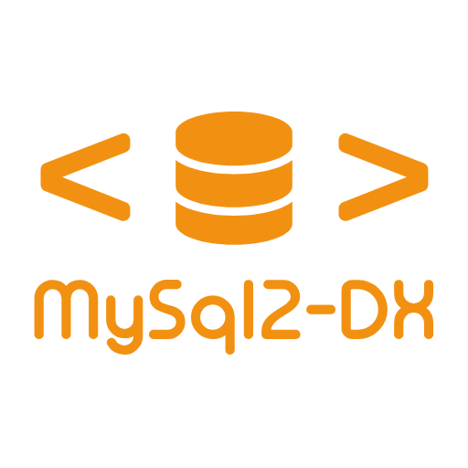

# mysql2-dx: The Developer-Experience-First MySQL Client

[](https://www.npmjs.com/package/@waelhabbaldev/mysql2-dx)
[](https://opensource.org/licenses/MIT)

<div align="center">
  
</div>


`mysql2-dx` is a lightweight, developer-friendly wrapper for the excellent `mysql2/promise` library. It simplifies common database operations, enforces type safety with [Zod](https://zod.dev/), and provides a clean, consistent API for everything from simple queries to complex, atomic batch operations.

This library is designed to reduce boilerplate, prevent common errors, and make your database interactions intuitive and safe.

### Key Features

-   **Type-Safe by Default:** Uses Zod schemas to validate and type your database results, catching data errors at the boundary.
-   **Powerful "Prisma-like" WHERE Clauses:** Build complex `UPDATE` and `DELETE` queries with a simple, nestable object syntax (`gt`, `in`, `OR`, `AND`, etc.). Empty `in`/`notIn` arrays are handled safely (`1=0` or `1=1`).
-   **Simplified CUD API:** Intuitive methods like `insert`, `update`, and `delete` reduce boilerplate.
-   **Robust Transactions:** A simple `executeTransaction` block that automatically handles `COMMIT` and `ROLLBACK`.
-   **Atomic & Parameterized Batching:** Run a mix of raw SQL and helper operations in a single, atomic transaction with `executeBatch`.
-   **Explicit Configuration:** No magic. You provide the configuration, giving you full control.
-   **Clear Error Handling:** Custom error types (`NotFoundError`, `ValidationError`) make catching specific issues easy.
-   **Smart Logging:** Enable `verbose: true` to see beautiful, colour‑coded query logs – but **only in non‑production environments** (logs are automatically disabled when `NODE_ENV === 'production'`). No performance hit in production.

## Installation

```bash
npm install @waelhabbaldev/mysql2-dx mysql2 zod
```

## Quick Start

`mysql2-dx` requires you to explicitly provide your database configuration. This ensures your application has full control over how it connects.

```typescript
import { createDatabaseClient } from "@waelhabbaldev/mysql2-dx";
import { z } from "zod";

// 1. Define your database configuration
const dbConfig = {
  host: "127.0.0.1",
  port: 3306,
  user: "root",
  password: "your_password",
  database: "your_db",
};

// 2. Create the client
const db = createDatabaseClient({ config: dbConfig, verbose: true });

// 3. Define a Zod schema for your data
const UserSchema = z.object({
  id: z.number(),
  name: z.string(),
  email: z.string().email(),
  age: z.number().nullable(),
});

async function main() {
  try {
    // Fetch a single user
    const user = await db.selectSingle(
      "SELECT * FROM users WHERE id = ?",
      [1],
      UserSchema
    );
    console.log("Found user:", user.name);

    // Insert a new user
    const result = await db.insert("users", {
      name: "Jane Doe",
      email: "jane.doe@example.com",
    });
    console.log(`New user created with ID: ${result.insertId}`);
  } catch (error) {
    console.error("Database operation failed:", error);
  } finally {
    // 4. Always close the connection pool when your app shuts down
    await db.close();
  }
}

main();
```

## Core API

### Fetching Data (`select*`)

These methods are for running `SELECT` queries and validating the results against a Zod schema.

-   `selectSingle<T>(query, params, schema)`: Fetches **exactly one** row. Throws a `NotFoundError` if no rows are found.
-   `selectSingleOrDefault<T>(query,params,schema)`: Fetches one row or `null` if no rows are found.
-   `selectMany<T>(query, params, schema)`: Fetches an array of rows. Returns an empty array `[]` if no rows are found.

### Modifying Data (`insert`, `update`, `delete`)

#### `insert` and `insertMany`

-   `insert(table, data)`: Inserts a new row.  
-   `insertMany(table, data[])`: Inserts multiple rows efficiently (optimised path when no raw SQL is used).

```typescript
// Insert a single user
await db.insert("users", { name: "John", email: "john@example.com" });

// Insert multiple users
await db.insertMany("users", [
  { name: "Alice", email: "alice@example.com" },
  { name: "Bob", email: "bob@example.com" },
]);
```

#### `update` and `delete` with Advanced `WHERE`

These methods use a powerful and intuitive `WhereCondition` object to build complex queries safely.

**Basic `AND` (Implicit):**  
Keys in the same object are joined with `AND`.

```typescript
// WHERE status = 'active' AND age > 30
await db.update("users", 
  { last_login: new Date() },
  {
    status: 'active',
    age: { gt: 30 } // gt = greater than
  }
);
```

**Complex `OR` and Nesting:**  
Use the `OR`, `AND`, and `NOT` keys for explicit logical grouping.

```typescript
// WHERE role = 'user' AND (email LIKE '%@gmail.com' OR age IN (20, 30))
await db.delete("users", {
  role: 'user',
  OR: [
    { email: { endsWith: '@gmail.com' } },
    { age: { in: [20, 30] } }
  ]
});

// WHERE age > 30 OR (name = 'Alice' AND status = 'inactive')
await db.update("users", { status: 'archived' }, {
  OR: [
    { age: { gt: 30 } },
    { name: 'Alice', status: 'inactive' }
  ]
});
```

**Empty `in` / `notIn` arrays are handled safely:**  
- `{ age: { in: [] } }` becomes `1=0` (never matches).  
- `{ age: { notIn: [] } }` becomes `1=1` (always matches).

**Available Operators:**  
- `equals`, `not`  
- `in`, `notIn`  
- `lt` (less than), `lte` (less than or equal)  
- `gt` (greater than), `gte` (greater than or equal)  
- `contains`, `startsWith`, `endsWith` (for `LIKE` operations)

### Raw SQL Expressions (⚠️ Deprecated)

The `sql()` helper allows you to inject raw SQL fragments into `insert` or `update` operations (e.g., `NOW()`, `age + 5`).

> **⚠️ Deprecated warning:** Using `sql()` bypasses all parameterisation and is a potential SQL injection vector. Use only for fixed, safe expressions. Prefer parameterised values whenever possible. The function is marked `@deprecated` and shows a strikethrough in modern IDEs.

```typescript
import { sql } from "@waelhabbaldev/mysql2-dx";

// Safe: fixed SQL function
await db.insert("users", {
  name: "Jane",
  created_at: sql("NOW()")
});

// UNSAFE – DO NOT DO THIS:
// const userInput = "'; DROP TABLE users; --";
// await db.insert("users", { name: sql(`'${userInput}'`) });
```

### Transactions

The `executeTransaction` method ensures a group of queries are executed atomically. It automatically handles `BEGIN`, `COMMIT`, and `ROLLBACK` for you.

```typescript
async function transferFunds(fromId: number, toId: number, amount: number) {
  return db.executeTransaction(async (trx) => {
    // 'trx' has the same API as 'db', but all queries run in this transaction
    const sender = await trx.selectSingle(
      "SELECT balance FROM accounts WHERE id = ?", [fromId], z.object({ balance: z.number() })
    );

    if (sender.balance < amount) {
      // This error will automatically trigger a ROLLBACK
      throw new Error("Insufficient funds.");
    }

    // Use parameterised queries or raw SQL where needed
    await trx.modify("UPDATE accounts SET balance = balance - ? WHERE id = ?", [amount, fromId]);
    await trx.modify("UPDATE accounts SET balance = balance + ? WHERE id = ?", [amount, toId]);

    console.log("Transfer successful!");
  });
}
```

### Atomic Batch Operations

`executeBatch` allows you to run multiple, different operations as a single, atomic unit. It's perfect for complex workflows. You can mix raw SQL with CUD helpers.

**Important:** You must use `as const` on the schemas array to ensure TypeScript can infer the correct return types.

```typescript
const [adminUser, updateResult, deleteResult] = await db.executeBatch(
  [
    // 1. A raw, parameterized SELECT query
    {
      sql: 'SELECT * FROM users WHERE id = ?',
      params: [1]
    },

    // 2. An UPDATE operation using the rich WhereCondition object
    {
      op: 'update',
      table: 'users',
      data: { status: 'archived' },
      where: { last_login: { lt: '2023-01-01' }, status: 'active' }
    },

    // 3. A DELETE operation
    {
      op: 'delete',
      table: 'login_attempts',
      where: { user_id: { in: [10, 11, 12] } }
    }
  ],
  // Schemas array must match the operations array
  [
    UserSchema,                      // For the SELECT
    DatabaseClient.MODIFY_SCHEMA,    // For the UPDATE
    DatabaseClient.MODIFY_SCHEMA     // For the DELETE
  ] as const
);

console.log(`Found admin: ${adminUser.name}`);
console.log(`Archived ${updateResult.affectedRows} users.`);
```

### Unsafe Methods

For performance-critical situations or when you want to bypass Zod validation, "unsafe" methods are available. They return raw `RowDataPacket` objects from `mysql2`. Use them with caution.

-   `selectSingleUnsafe(query, params)`
-   `selectSingleOrDefaultUnsafe(query, params)`
-   `selectManyUnsafe(query, params)`
-   `executeBatchUnsafe(operations)`

### Error Handling

`mysql2-dx` exports custom errors to help you write more precise `try...catch` blocks.

-   `DatabaseError`: The base error for all library-specific issues.
-   `NotFoundError`: Thrown by `selectSingle` when no record is found.
-   `ValidationError`: Thrown when database results fail Zod parsing.

```typescript
import { NotFoundError, ValidationError } from "@waelhabbaldev/mysql2-dx";

try {
  const user = await db.selectSingle(/* ... */);
} catch (error) {
  if (error instanceof NotFoundError) {
    // Handle case where user does not exist
  } else if (error instanceof ValidationError) {
    // Handle schema mismatch (e.g., log to an error service)
    console.error("Data validation failed:", error.cause);
  } else {
    // Handle other database errors (connection, syntax, etc.)
  }
}
```

---

## License

This project is licensed under the MIT License.